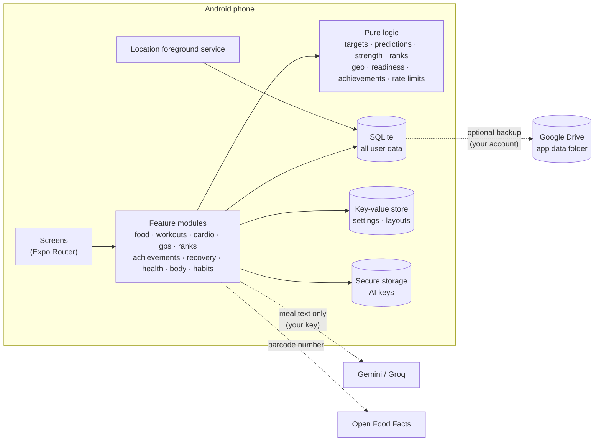

<div align="center">

# Metakai

**Build the body you want.**

Food, training, cardio, recovery and progress in one private, offline-first Android app.

[Download for Android](https://github.com/tfthushaar/metakai/releases/latest) · [Privacy](https://tfthushaar.github.io/metakai/privacy.html) · [Terms](https://tfthushaar.github.io/metakai/terms.html)

</div>

---

## Overview

Metakai is a fitness tracker for people who want one app for their whole physique goal: cutting, bulking, recomposition or maintenance. It turns plain-language meals into calories and macros, sets targets from your body and goal, predicts your progress, and tracks strength training, GPS runs, recovery and health markers.

Three principles shape the app:

- **Private by design.** All data lives on the phone. There are no Metakai servers or accounts, and no analytics or ads.
- **No bloat.** Every feature is a module you can switch off. Each screen's sections and shortcuts can be reordered or hidden.
- **Free to run.** Optional cloud features use your own Google Drive and your own free AI keys.

## Features

### Nutrition
- **Plain-language logging:** “2 rotis, 1 katori dal and 150g paneer” becomes an itemised list with calories, protein, carbs, fat and fiber.
- **Offline food database** with Indian and international foods, barcode scanning (Open Food Facts), saved meals and quick add.
- **AI for unknown foods** using your own free Google Gemini or Groq key. Requests are spread across several models with per-model quota tracking and automatic failover. Answers are cached and learned foods are saved for offline use.
- **Targets** from Mifflin-St Jeor or Katch-McArdle, with safe calorie and protein floors, adaptive maintenance estimates and optional training-day carbs.

### Goals and progress
- **Goal types:** cut, lean bulk, bulk, recomp, maintain, mini cut, diet break, reverse diet, strength focus and event prep.
- **Predictions:** a week-by-week forecast with a confidence band, a smoothed trend weight, goal date and ahead/behind status.
- **Physique planner** that turns a target body into a phase timeline, plus weekly check-ins with suggested adjustments.
- **Body tracking:** measurements, body fat (tape, calipers or manual), lean mass and FFMI.
- **Private progress photos** with a before/after slider and milestone cards.

### Strength training
- **Exercise library** of 876 exercises with demos, plus custom exercises.
- **Workout logger** with previous performance, warm-ups, rest timer, PR detection and a plate calculator.
- **One-line logging:** type `bench 3x8 60` or `deadlift 100x5 120x3` to save a finished workout, with estimated calories burned.
- **Splits:** Push/Pull/Legs, Upper/Lower, Full body, PHUL, Arnold or Bro split, or build your own with exercises for each muscle group.
- **Progressive overload tracking**, double progression with deload hints, weekly muscle volume and strength standards.

### Cardio and GPS
- **GPS recording** for runs, walks, hikes and rides:
  - Live distance, pace or speed, and the route as you move.
  - Keeps tracking with the screen off, with spoken splits.
  - Per-km or per-mile splits, elevation gain and best efforts from 1 km to marathon.
  - Needs only “while using the app” location access.
- **Cardio log** for any activity, with calorie estimates.
- **Interval timer** for Tabata, HIIT, EMOM and custom rounds.

### Recovery and health
- **Readiness score** from a 30-second morning check-in (sleep, soreness, stress, energy, mood) combined with recent training load.
- **Muscle recovery** estimates for each muscle group.
- **Supplement checklist** and health markers: blood pressure, resting heart rate, HRV, fasting glucose, steps and lab results, with trends.
- **Habits** that tick themselves off from your logs, plus reminders.

### Ranks and achievements
- **Physique pass:** every muscle group gets a rank, from Iron to Champion with three divisions per tier.
  - Scores come from your best key lifts and how consistently you train the group.
  - Each group shows how you compare with the average person of your sex, age, weight and height (percentile and "× average").
  - Filters: people like you, same weight, same height, same sex, or everyone.
  - A radar chart shows your balance, and weak groups pull the overall rank down.
- **Run pass:** 1 km to marathon times are age-graded against world bests for your age and sex, so every runner is ranked fairly. It shows your age-grade class and how many people your age you're faster than.
- **Achievements:** over 50 badges across training, running, nutrition, body, consistency and ranks, with progress toward the ones you haven't earned yet.
- **Share cards:** any earned badge or pass rank can be shared as an image.

### Personalisation
- **Features:** turn any feature on or off, or start from a preset.
- **Layout:** reorder or hide cards on Today, sections on Train and Progress, and shortcuts in the + menu. Choose which tab the app opens on.
- **Appearance:** light, dark or system mode, six accent colours, true-black or graphite dark style, four text sizes, reduce motion and haptics.
- **Units:** metric or imperial.

### Your data
- **Local storage:** everything is stored in SQLite on the phone and works fully offline.
- **Google Drive backup (optional):** saves to a hidden app folder in your own Drive, updates automatically and restores onto a new phone.
- **Backup files:** export and import, with or without photos.
- **Security:** app lock with fingerprint or face unlock, and one tap to erase everything.

## Architecture



- **Offline-first:** every screen reads from the local SQLite database through small repositories, and screens re-render when the tables they use change.
- **Feature registry:** each module declares its dependencies and permissions. Screens, tabs, Today cards and shortcuts check it before rendering.
- **Pure logic:** calculations live in `src/lib` as dependency-free, unit-tested functions, including energy and macros, predictions, 1RM and progression, body composition, GPS track maths, population strength norms and age grading, readiness, achievements and AI rate budgets.
- **No backend:** the only network calls are the optional ones shown above, made directly from the phone.

## Quick start

1. **Install.** Download the latest APK from [Releases](https://github.com/tfthushaar/metakai/releases/latest) on your Android phone, open it and allow installs from that source. Updates install over the previous version and keep your data.
2. **Set up.** Tap **Get started** and answer a few questions: body stats, activity, experience and goal. Metakai calculates your calorie and macro targets.
3. **Log food.** Tap **+ → Log food** and type what you ate in plain words, or scan a barcode.
4. **Weigh in.** Log your weight in the morning a few times a week. The trend line and predictions improve as data comes in.
5. **Train.** Pick a split on the **Train** tab, then tap **Start** to log live or **Log done** to type a finished workout. Use **Record** for GPS runs and rides.
6. **Make it yours.** Go to **You → Features** to switch off what you don't use, **You → Layout** to arrange screens, and **You → Appearance** for themes and text size.
7. **Back up.** Go to **You → Backup & sync** to connect Google Drive or export a backup file.
8. **Optional AI.** Go to **You → AI**, tap **Get a key**, create a free key and come back. Metakai pastes it for you.

## Building from source

**Requirements:** Node.js 22+, Android Studio (SDK and an emulator or device), JDK 17.

```bash
git clone https://github.com/tfthushaar/metakai.git
cd metakai/app
npm install
npm test              # unit tests
npm run typecheck     # TypeScript
npx expo run:android  # build and run a development build
```

**Release builds.** The signing config reads these environment variables:

| Variable | Purpose |
|---|---|
| `METAKAI_KEYSTORE` | Path to the release keystore |
| `METAKAI_KEYSTORE_PASSWORD` | Keystore password |
| `METAKAI_KEY_ALIAS` | Key alias |
| `METAKAI_KEY_PASSWORD` | Key password |

```bash
npx expo prebuild --platform android --clean
cd android && ./gradlew assembleRelease
```

Tagged pushes (`v*`) build and publish a signed APK through GitHub Actions when the matching `ANDROID_KEYSTORE_*` secrets are set.

**Google Drive backup in your own build:**
1. In Google Cloud, enable the Google Drive API.
2. Configure the OAuth consent screen with the `drive.appdata` scope.
3. Create an Android OAuth client with package `com.tfthushaar.metakai` and your signing certificate's SHA-1.

No client ID goes into the code.

## Project structure

```
app/
  src/app/        Screens and navigation (Expo Router)
  src/core/       Database, settings, layouts, theme, backup, Drive, app lock
  src/lib/        Pure, unit-tested calculations
  src/modules/    Feature modules: food, workouts, cardio, gps, ranks, achievements, recovery, health, body, habits
  src/ui/         Design system components
  plugins/        Expo config plugins (release signing)
docs/             Product plan and website (privacy policy, terms)
scripts/          Icon and exercise data generators
.github/          CI and release workflows
```

## Tech stack

| Area | Technology |
|---|---|
| App | React Native, Expo, Expo Router, TypeScript |
| UI | Reanimated, Gesture Handler, react-native-svg, Lucide icons, Inter |
| State and storage | Zustand, expo-sqlite (SQLite and key-value), expo-secure-store |
| Device | expo-location with task manager, expo-camera, expo-notifications, expo-local-authentication, react-native-view-shot |
| Cloud (optional) | Google Sign-In and Drive REST API, Gemini and Groq APIs |
| Quality | Jest, TypeScript strict mode, GitHub Actions |

## Privacy

Metakai has no servers and collects nothing. Your data stays on your phone unless you back it up to your own Google Drive. AI requests send only the meal text you choose to analyse, directly to Google or Groq with your own key. Read the full [privacy policy](https://tfthushaar.github.io/metakai/privacy.html).

## Disclaimer

Calorie, macro, body composition, readiness, rank and calorie-burn figures are estimates for general fitness purposes, not medical advice. Talk to a doctor or qualified professional before starting a diet or training program.
