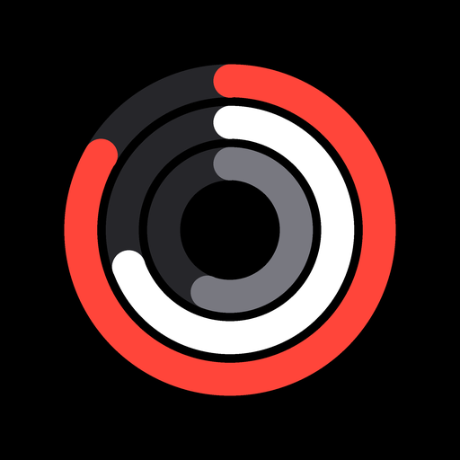
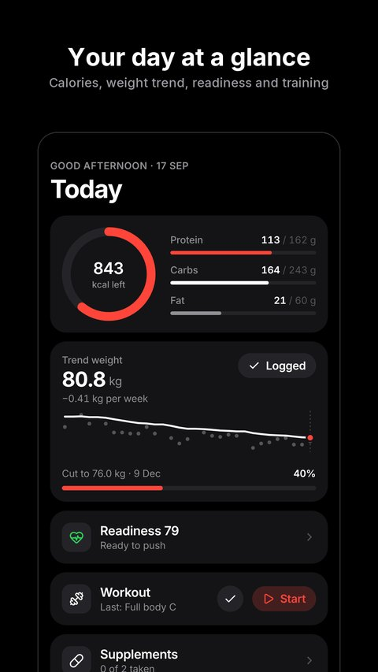
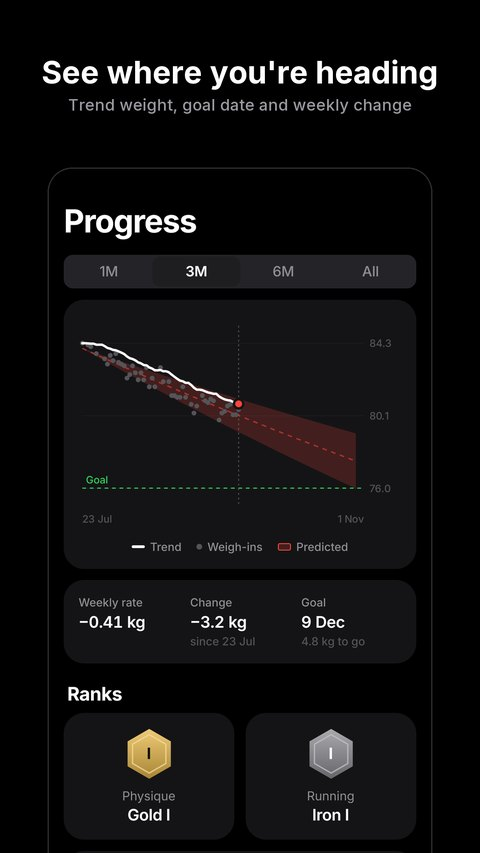
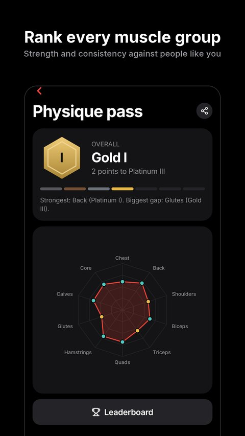
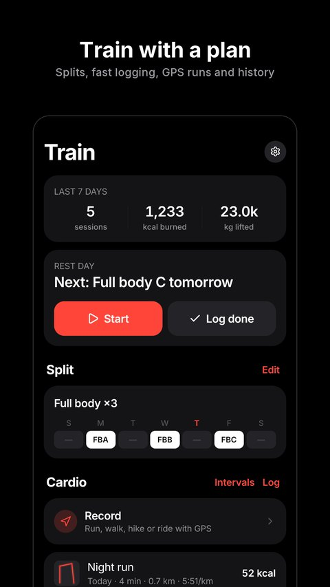

# Metakai

**Build the body you want.**

Food, training, runs, recovery and progress in one private app that works with your watch. 
No ads. No account. Your data stays on your phone.

[**Download for Android**](https://github.com/tfthushaar/metakai/releases/latest) · [**Open on iPhone or the web**](https://tfthushaar.github.io/metakai/app/) · [Privacy](https://tfthushaar.github.io/metakai/privacy.html) · [Terms](https://tfthushaar.github.io/metakai/terms.html)

▶ <a href="https://tfthushaar.github.io/metakai/assets/metakai.mp4">Watch with sound</a>

  
  
  
  

Cutting, bulking, recomposing or maintaining: set a goal and get calorie and macro targets built from your body. Log meals the way you'd say them, train with a logger that remembers your last session, and watch a forecast turn your trend weight into a goal date. Everything you don't need switches off.

## Food

- **Type meals in plain words.** “2 rotis, 1 katori dal and 150g paneer” becomes itemised calories, protein, carbs, fat and fiber.
- **A food database that works offline,** with Indian and international dishes, barcode scanning, saved meals and quick add.
- **Your calories, your call.** Follow a weekly pace, or set your own daily calories and watch the macros, goal date and forecast follow.
- **Recipe ideas** from the ingredients you have. List them or take a photo, and get recipes that fit what's left of your day.
- **Unknown foods** are looked up with your own free Gemini or Groq key, then saved for offline use.

## Progress

- **A goal date you can trust,** forecast from your trend weight rather than day-to-day noise.
- **Goals for every phase:** cut, lean bulk, bulk, recomp, maintain, mini cut, diet break, reverse diet, strength focus and event prep.
- **Weekly check-ins** with suggested adjustments, plus short notes from an optional AI coach.
- **Body tracking:** measurements, body fat, lean mass, FFMI and private progress photos with a before/after slider.

## Training

- **876 exercises** with demos, or add your own.
- **A workout logger** with your previous performance, warm-ups, a rest timer, PR detection and a plate calculator.
- **Log a finished workout in one line:** `bench 3x8 60`.
- **Ready-made splits** (Push/Pull/Legs, Upper/Lower, Full body, PHUL, Arnold, Bro split) or build your own.
- **Progressive overload** tracking, weekly muscle volume and strength standards.

## Runs and rides

- **GPS recording** for runs, walks, hikes and rides, with live pace, spoken splits and your route, even with the screen off.
- **Best efforts** from 1 km to marathon, elevation gain and per-km or per-mile splits.
- **Any other cardio** in a tap, plus a Tabata, HIIT and EMOM interval timer.

## Watches

- **Bring your watch data in:** steps, active calories, sleep with its stages, resting heart rate, HRV, VO2 max, blood oxygen, breathing rate, smart-scale weigh-ins and workouts from Samsung Galaxy Watch, Pixel Watch, Fitbit, Garmin, Withings, Oura, Polar, Amazfit and Xiaomi through Health Connect, or from Apple Watch and others through Apple Health.
- **One overview for every device:** last night's sleep stages, readiness and each day's readings side by side, even when they come from different watches. Wear a ring to bed and a watch to the gym, and pick which app each kind of reading comes from.
- **No doubled workouts:** a gym session or run you log here that your watch also recorded gets the watch's heart rate and calories instead of showing up twice. Everything else, from runs to yoga, lands in your activity log.
- **Live heart rate** on screen while you lift or run, from chest straps and watches that broadcast it, with your average and peak saved to the session.
- **Send it back:** your Metakai workouts and weigh-ins can show up in Health Connect or Apple Health too.
- **Stays on your phone.** Watch data is read straight from Health Connect or Apple Health, never through anyone's server.

## Recovery and health

- **A readiness score** from your sleep and its stages, HRV and resting heart rate against your own normal, a 30-second morning check-in and your training load from every session. A watch alone, a check-in alone or both all work, and you can see what moved the score.
- **Muscle recovery** for each muscle group.
- **Supplements and health markers:** blood pressure, resting heart rate, HRV, glucose, steps and lab results.
- **Habits** that tick themselves off from what you log.

## Ranks

- **Physique pass:** every muscle group ranked from Iron to Champion by your strength and consistency, compared with people of your sex, age, weight and height.
- **Run pass:** your 1 km to marathon times, age-graded so every runner is ranked fairly.
- **Over 50 achievements,** each shareable as a card.
- **Optional leaderboards** by sex, age group, weight class, height, country or friends. Joining shares only a display name, rounded body stats and your scores, and leaving deletes them.

## Make it yours

- **Switch off whole features** you don't use; their tabs, cards and shortcuts disappear with them.
- **Arrange every screen:** reorder or hide cards and shortcuts, and pick the tab the app opens on.
- **Home screen widgets on Android:** calories left, today's readiness with last night's sleep, and a row of your own quick actions. They follow your theme, refresh as you log, and log a glass of water without opening the app.
- **Any colour you like:** light, dark or true black, preset accents, or a custom theme with your own accent, second colour and background.
- **Text size, reduce motion, haptics** and metric or imperial units.

## On iPhone and the web

Until Metakai is on the App Store, the web app gives you the same food logging, training, progress, ranks, recipes, AI and themes on any iPhone or computer. Add it to your home screen and it opens full screen like an app, works offline and updates itself.

- **Your data stays in that browser** on that device, just like on a phone. Connect Google Drive or export a backup file from **You → Backup & sync** to keep a copy.
- **Phone-only for now:** watch sync and live heart rate, GPS run recording, progress photos, reminders and app lock. These come with the App Store app.
- **Google sign-in** (for Drive and leaderboards) lasts an hour on the web; after that, **Back up now** signs you in again with one tap.

## Private by design

- **On your phone, offline.** No account, no ads, no analytics.
- **Backups in your own Google Drive,** in a hidden app folder, ready to restore onto a new phone. Or export a file.
- **App lock** with fingerprint or face unlock, and one tap to erase everything.
- **AI only when you ask,** with your own key, sending only the meal text or ingredient photos you choose to analyse.
- **A build with no Google Play services,** for phones without Google's apps and for F-Droid. Reminders, GPS runs, barcode scanning, Google Drive backup and the leaderboards all work without Google Play services, Firebase or any other proprietary library.

Read the full [privacy policy](https://tfthushaar.github.io/metakai/privacy.html).

## Get started

1. **Android:** download the latest APK from [Releases](https://github.com/tfthushaar/metakai/releases/latest), open it and allow installs from that source. Updates install over the previous version and keep your data. Choose `metakai-<version>-foss.apk` if you want the build with no Google Play services. 
   **iPhone:** open [the web app](https://tfthushaar.github.io/metakai/app/) in Safari, tap **Share → Add to Home Screen**, and open Metakai from your home screen.
2. Tap **Get started** and answer a few questions about your body, activity and goal.
3. Tap **+** to log food, weigh in, start a workout or record a run.
4. Head to **You** to connect your watch, switch features off, arrange screens, change the theme, back up, or add a free AI key.

---

Calorie, macro, body composition, readiness, rank and calorie-burn figures are estimates for general fitness, not medical advice. Talk to a doctor or qualified professional before starting a diet or training program.

Free and open source under the [MIT License](LICENSE). Building from source, architecture and release setup: [docs/DEVELOPMENT.md](docs/DEVELOPMENT.md).
