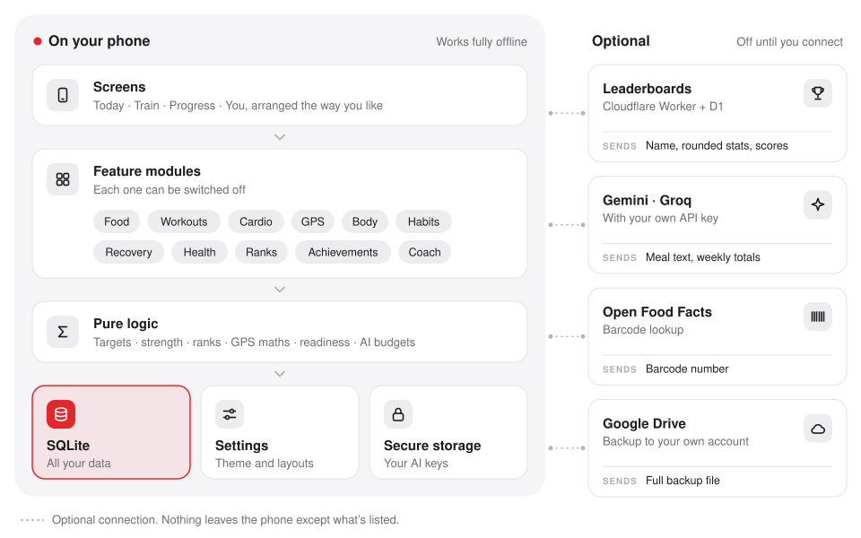

# Development

How Metakai is built, and how to build, sign and publish it yourself.

## Architecture

<p align="center">
  <picture>
    <source media="(prefers-color-scheme: dark)" srcset="assets/architecture-dark.svg">
    
  </picture>
</p>

- **Offline-first:** every screen reads from the local SQLite database through small repositories, and screens re-render when the tables they use change.
- **Feature registry:** each module declares its dependencies and permissions. Screens, tabs, Today cards and shortcuts check it before rendering, and a tab with nothing left to show leaves the tab bar.
- **Pure logic:** calculations live in `src/lib` as dependency-free, unit-tested functions, including energy and macros, predictions, 1RM and progression, body composition, GPS track maths, population strength norms and age grading, readiness, achievements and AI rate budgets.
- **Watches:** `src/modules/wearables` reads and writes Health Connect on Android (`react-native-health-connect`) and Apple Health on iOS (`@kingstinct/react-native-healthkit`) behind one interface, and pairs Bluetooth heart rate sensors with `react-native-ble-plx`. Imports are de-duplicated by the health platform's record ID, and records Metakai wrote itself are skipped. Parsing and mapping live in `src/lib/wearables.ts`.
- **Several devices:** every sleep night and daily reading keeps the app it came from (`origin`). A night comes from one app (the user's choice, else the one with stages and the most sleep) and each day's reading from one app, so two devices never add up or blend. Watch workouts that overlap a gym session or run logged in Metakai are linked to it (`external_id`) instead of imported again, and aren't sent back to the health app.
- **Readiness:** `src/lib/recoveryScore.ts` combines sleep (with deep and REM share), HRV (log scale) and resting heart rate against a 30-day baseline from the same app, the check-in, and training load (TRIMP from heart rate, else sets or effort; 7 days against 28). With only a check-in it gives exactly the old `readiness()` score.
- **Minimal backend:** the optional leaderboard is a small Cloudflare Worker with a D1 (SQLite) database in `cloud/`. It verifies Google or Apple sign-in, stores only derived scores, and precomputes score distributions every six hours to stay within the free tier. Every other network call goes directly from the phone to the service shown.

## Building from source

**Requirements:** Node.js 22+, Android Studio (SDK and an emulator or device), JDK 17. The app needs Android 8.0 (API 26) or newer, which Health Connect requires.

```bash
git clone https://github.com/tfthushaar/metakai.git
cd metakai/app
npm install
npm test              # unit tests, plus database tests that run every migration on sql.js
npm run typecheck     # TypeScript
npx expo run:android  # build and run a development build
```

### Android release builds

The signing config reads these environment variables:

| Variable | Purpose |
|---|---|
| `METAKAI_KEYSTORE` | Path to the release keystore |
| `METAKAI_KEYSTORE_PASSWORD` | Keystore password |
| `METAKAI_KEY_ALIAS` | Key alias |
| `METAKAI_KEY_PASSWORD` | Key password |

`scripts/release-android.sh` sets them from `~/.metakai-signing` and builds a Play Store bundle and an APK into `dist/`. Tagged pushes (`v*`) also build a signed APK through GitHub Actions when the matching `ANDROID_KEYSTORE_*` secrets are set.

### Health Connect and Apple Health

- `plugins/withWatches.js` adds the Health Connect permissions and a small activity that opens the privacy policy when Health Connect asks why the app wants access. Google Play requires the permissions to be declared in Play Console before release; the justification for each is in [store/declarations.md](../store/declarations.md).
- Health Connect is built into Android 14 and newer. On older phones the app sends users to the Health Connect app on Google Play.
- The HealthKit config plugin adds the HealthKit entitlement and the usage strings in `app.json`. Background delivery is off; the app syncs when it opens.
- To try sync on an emulator without a watch, install Google's Health Connect Toolbox and write test records (sleep with stages, HRV, resting heart rate, exercise sessions) under different apps.

### Home screen widgets (Android)

`react-native-android-widget` draws widgets from JavaScript, so they show the same data as the app without a separate native codebase.

- **Declared in `app.json`** through the library's config plugin: `Calories`, `Readiness` and `QuickLog`, each with a preview image in `app/assets/widgets`. `app/index.ts` is the app's entry point so `registerWidgets()` runs even when the widget wakes the app in the background.
- **Code lives in `src/widgets`:** `data.ts` reads from the database (`readBody()` is `useBody()` without React), `Widgets.tsx` draws them with the library's views, `render.tsx` picks light or dark colours from the app's theme, and `refresh.android.ts` redraws them shortly after anything they show changes. iOS and the web get empty stand-ins (`register.ts`, `refresh.ts`, `WidgetGallery.tsx`).
- **Quick log** mirrors the user's own choices from You → Layout. Actions open a `metakai://` link; the water action is handled in the background by the task handler.
- **Icons** are lucide paths in `src/widgets/icons.ts`, because widgets draw SVG rather than React components.
- **Adding to the home screen:** You → Widgets shows a live preview of each and asks the launcher to pin it.

### Web app

The same code builds a web app for iPhone (before the App Store release) and computers, served by GitHub Pages at <https://tfthushaar.github.io/metakai/app/>.

```bash
bash scripts/build-web.sh   # exports to docs/app and writes the service worker; commit and push to publish
```

- **Database:** browsers run SQLite through [sql.js](https://sql.js.org) (`app/public/sqljs`), loaded with a script tag so the bundler never sees it. The database lives in memory and is saved to IndexedDB after each write (`src/core/db/engine.web.ts`). Expo's own web SQLite needs cross-origin isolation headers that Safari and GitHub Pages don't support.
- **Platform files:** `*.web.ts` files replace their native twins on the web: the database engine, the key-value store, secure storage (localStorage) and Google sign-in.
- **Google sign-in** uses OAuth's browser redirect flow (`src/core/google.web.ts`), which needs `https://tfthushaar.github.io/metakai/app/` as an authorised redirect URI on the web OAuth client. The leaderboard server swaps the Google ID token for a Metakai session at `POST /v1/auth/google`.
- **Rulers:** react-native-web never reports drags from a scroll view and ignores snapping, so `RulerPicker.web.tsx` moves the strip itself from pointer events (mouse, touch and pen) with momentum, snapping, sideways trackpad scroll, the keyboard and slider semantics for screen readers. The maths is in `src/lib/ruler.ts`. The native ruler is untouched.
- **Phone-only features** (GPS, watches, progress photos) are marked `phoneOnly` in the feature registry and hidden on the web, along with anything that depends on them.
- **Offline and routing:** `scripts/web-sw.mjs` writes a service worker that caches the build. `docs/404.html` is a copy of the app, so reloading on any screen works on GitHub Pages.
- **Sub-path:** `experiments.baseUrl` is `/metakai/app`; files in `app/public` aren't rewritten, so their paths include it.

### iOS builds

iOS builds run on EAS Build, so no Mac is needed:

```bash
cd app
npx eas-cli build --platform ios --profile production
```

Publishing steps, store text and policy answers for Google Play and the App Store are in [store/](../store/README.md).

### Google sign-in

Needed for Drive backup, and for leaderboards on Android.

1. In Google Cloud, enable the Google Drive API.
2. Configure the OAuth consent screen with the `drive.appdata` scope.
3. Create a web OAuth client and set `EXPO_PUBLIC_GOOGLE_WEB_CLIENT_ID` in `app/.env`.
4. Create an Android OAuth client with package `com.tfthushaar.metakai` and your signing certificate's SHA-1.
5. For iOS, create an iOS OAuth client and set `EXPO_PUBLIC_GOOGLE_IOS_CLIENT_ID` in `app/.env`.

### Leaderboard server

```bash
cd cloud
npm install
npx wrangler login
npx wrangler d1 create metakai-ranks     # put the database_id in wrangler.toml
npm run migrate
npx wrangler secret put ID_PEPPER        # any long random string
npx wrangler secret put SESSION_SECRET   # another long random string
npm run deploy
```

Then set `EXPO_PUBLIC_RANKS_API` in `app/.env` to the Worker URL. `GOOGLE_CLIENT_ID` in `wrangler.toml` and `EXPO_PUBLIC_GOOGLE_WEB_CLIENT_ID` in `app/.env` must be the same OAuth web client.

On iOS the leaderboards use Sign in with Apple. To revoke Apple sign-in when a profile is deleted, also set `APPLE_TEAM_ID`, `APPLE_KEY_ID` and `APPLE_PRIVATE_KEY` (a Sign in with Apple key).

To test locally, create `cloud/.dev.vars` with `ID_PEPPER` and `DEV_AUTH=1`, run `npm run dev`, and point `app/.env.local` at it with `EXPO_PUBLIC_RANKS_DEV_TOKEN=dev:you`.

## Project structure

```
app/
  src/app/        Screens and navigation (Expo Router)
  src/core/       Database, settings, layouts, theme, backup, Drive, app lock
  src/lib/        Pure, unit-tested calculations
  src/modules/    Feature modules: food, workouts, cardio, gps, ranks, achievements, recovery, health, body, habits, wearables
  src/ui/         Design system components
  plugins/        Expo config plugins (release signing, Health Connect)
docs/             Website (privacy policy, terms, data deletion), the built web app (docs/app), product plan and this guide
cloud/            Leaderboard API (Cloudflare Workers + D1)
store/            Store listing, policy answers and graphics for Google Play and the App Store
scripts/          Android release and web builds, icon, store graphic and exercise data generators
.github/          CI and release workflows
```

## Tech stack

| Area | Technology |
|---|---|
| App | React Native, Expo, Expo Router, TypeScript |
| UI | Reanimated, Gesture Handler, react-native-svg, Lucide icons, Inter |
| State and storage | Zustand, expo-sqlite (SQLite and key-value), expo-secure-store |
| Device | expo-location with task manager, expo-camera, expo-notifications, expo-local-authentication, react-native-view-shot, Health Connect, HealthKit, Bluetooth LE |
| Cloud (optional) | Google Sign-In and Drive REST API, Gemini and Groq APIs, Cloudflare Workers + D1 |
| Quality | Jest, TypeScript strict mode, GitHub Actions |
